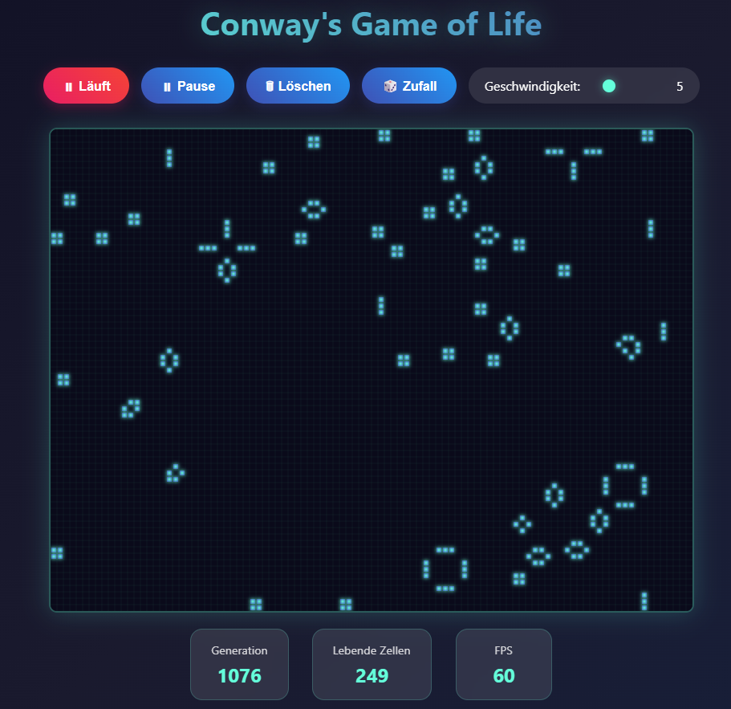

# Conway's Game of Life – Modern Web Edition

Dies ist eine moderne, visuell ansprechende Umsetzung von [Conway's Game of Life](https://en.wikipedia.org/wiki/Conway%27s_Game_of_Life) – umgesetzt in reinem HTML, CSS und JavaScript.

_In freundlicher Kooperation mit Claude und ChatGPT._

## 🎯 Ziel

Die klassische Zellsimulation in einem klaren, eleganten Look – mit Animationen, vordefinierten Mustern und flüssiger Benutzersteuerung.
Ein visuelles Showcase für Minimalismus, Interaktivität und stilvolles UI-Design.

## ✨ Features

- Responsive Oberfläche (auch mobil bedienbar)
- Verschiedene vorgefertigte Muster (Gleiter, Pulsar, Gosper-Glider-Gun u.a.)
- FPS-Anzeige & Generationszähler
- Geschwindigkeit regelbar per Slider
- Moderne Glow- und Farbverläufe
- Code ist modular aufgeteilt in `HTML`, `CSS`, `JS`

## 📷 Vorschau



## 🛠️ Lokale Nutzung

1. Repository klonen oder ZIP herunterladen
2. Öffne `index.html` in einem modernen Browser

```bash
git clone https://github.com/chefkoch0312/cgol.git
cd cgol
start index.html
```

Kein Server notwendig – läuft vollständig im Browser.

## 📁 Struktur

```bash
.
├── index.html       # Struktur & Einstiegspunkt
├── style.css        # Visuelles Styling
├── gameoflife.js    # Spiellogik & Interaktivität
└── screenshot.png   # Vorschau für GitHub
```

## 📄 Lizenz

MIT – frei zur Nutzung, Weiterverwendung und Modifikation.
Credits für die mathematische Idee: John Conway (1970)

---

🌀 _"It’s not a game in the traditional sense – but it shows how order can emerge from chaos."_
